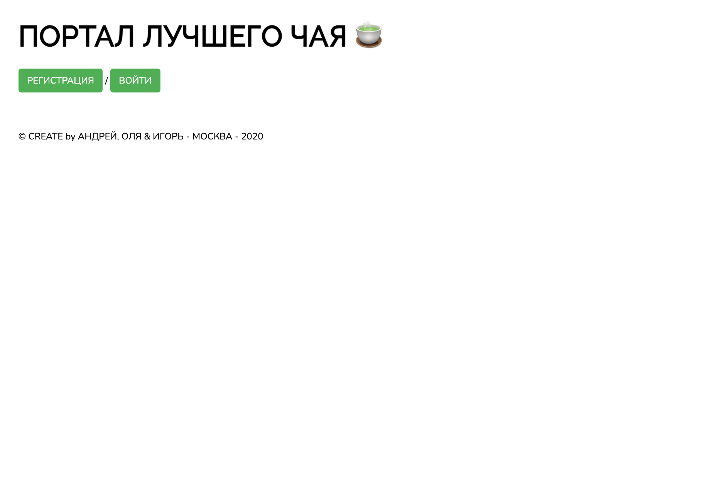
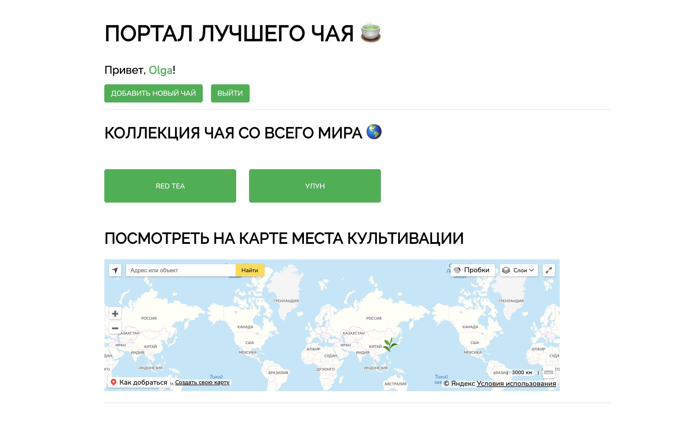
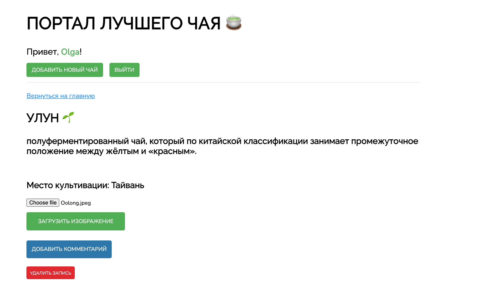
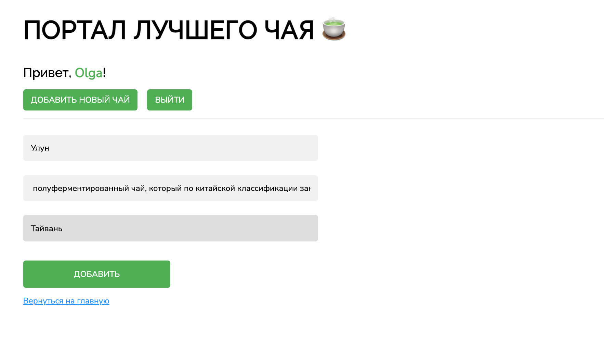

# Tea-drinking
Small app with information about variety of tea. Created with express and hbs.

# Установка 
 
git clone git@github.com:OlgaGordeeva-Al/Tea-drinking.git
npm i
npm start

# Описание
Проект представляет собой сайт с возможностью авторизации, добавления, редактирования, удаления и комментирования записей о чае.
Содержит 2 части с серверной частью приложения (routes, views, app.js) и клиентской частью (public)

# Главная страница

# Главная после авторизации

# Страница чая 

# Добавление чая

# Авторы 
1. views, routes - Гавриил Волков, Ольга Гордеева.
2. Работа с yandex api - Андрей Коваленко.
3. Дизайн сайта - Гавриил Волков.
